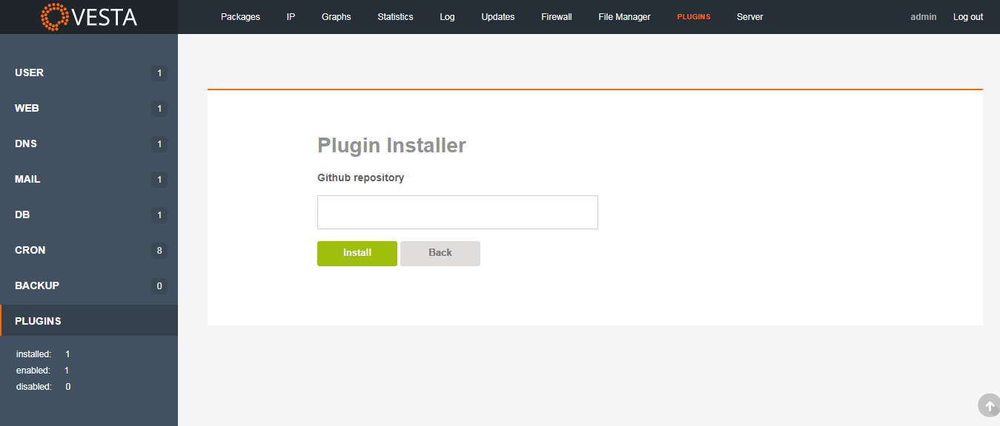

## This Script is based on [VestaCP Web Apps](https://github.com/jhmaverick/vestacp-web-apps) by [João Henrique](https://github.com/jhmaverick) But In English
## Vesta App Installer (ENG)
## ScreenShot

## Installation
* Install [Vesta Plugins](https://github.com/jhmaverick/vestacp-plugin-manager) if it's not already installed.
* First Go to Plugins Tab and Press the Green "+" Icon To Install New Plugin

* Second add the plugin by url `https://github.com/mohmadhabib/vestacp-web-apps` and Press Install, Then the Messag will Appear to Say Plugin is Installed successfully.

